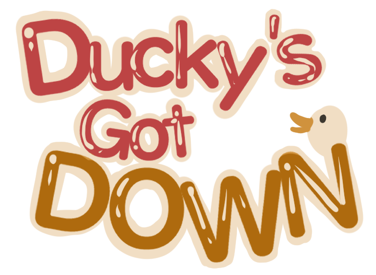

# Ducky's Got Down

> **GMTK game jam 2026 submission** | Made in 4 days with Godot 4.7 

> :joystick: **[Download the game on Itch.io](https://soft-potato.itch.io/duckys-got-down)**

---

## Overview

*Ducky's Got Down* is a survival clicker gmae developed for the Game Makers Tool Kit (GMTK) 2026 game jam in a team of 7. Protect the duck, upgrade feather production, fend off hungry wolves, and survive winter.

### :video_game: Core Mechanics
- **Resource Management:**  Collect feathers to unlock new upgrades and improve your collection efficiency.
- **Protect the Duck:** Shoo wolves away from the duck by clicking on them.
- **Survive the Winter:** Ensure that you have enough feathers during the winter, otherwise you'll freeze to death.
- **Customization:** Click the duck to both quack and change the hats. 

### :busts_in_silhouette: Team Members

- **Project Manager:** Benjamin
- **Programmers:** Brandon, Diego, and Dennis
- **Artist:** Ivy
- **Writer:** Leo
- **Tester:** Max
